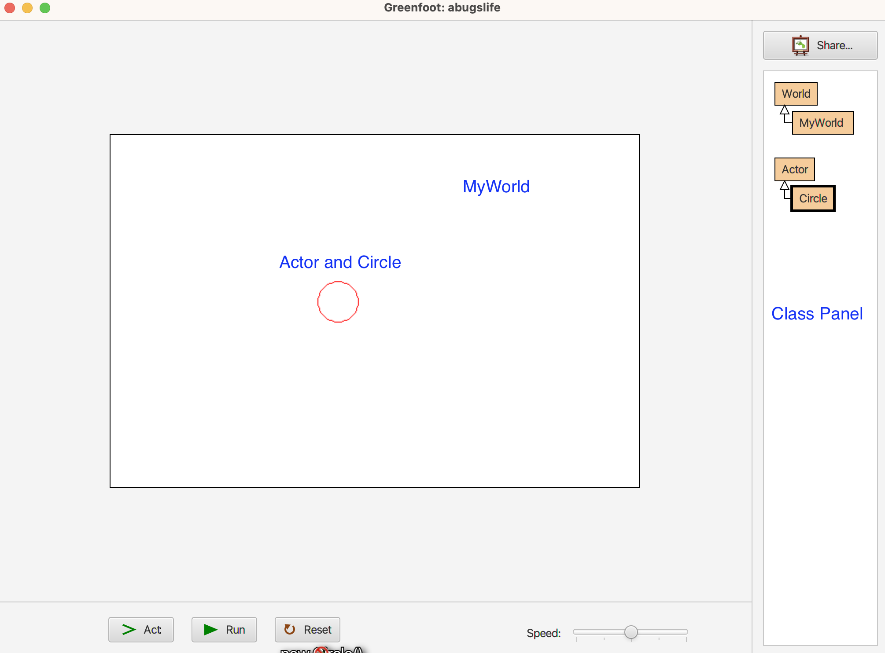
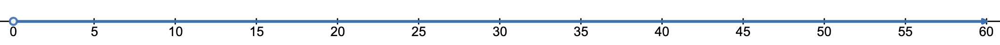
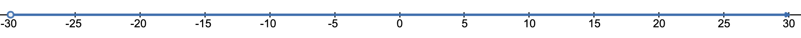
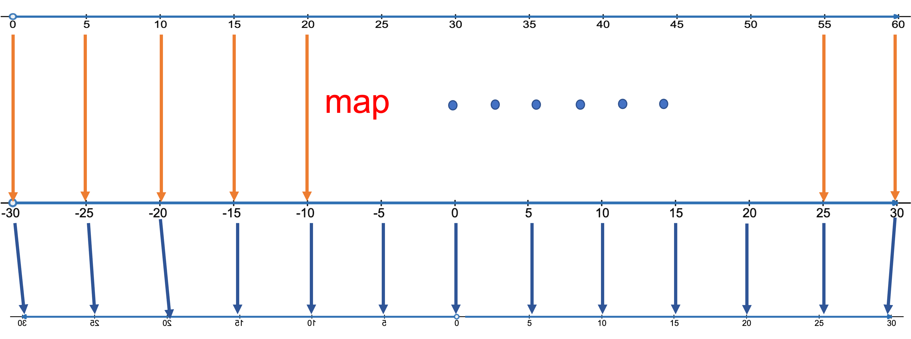

# Recitation 2 - Circle Envy

## Learning Objective

i. Develop experience with Java input and output functionality.

ii. Use type casting to force type conversion without producing a compiler error.

iii. Use different primitive types in Java.

## Introduction

In this recitation, you will begin to develop familiarity with using Greefoot. Then, you will design an animated circle that continuously grows and contracts using branching or explicit looping.

## What is Greenfoot you ask?

Greenfoot is a 2-dimensional gaming platform with a compact Java API that makes learning Java while also creating games. The platform was designed and developed by the same group that developed BlueJ. Greenfoot consists of a world and actors that interact with the world and with each other. The platform starts with some base abstract classes that contain all the behaviors of a world object and an actor object. Those behaviors are inherited by any world or actor that the programmer defines. So, Greefoot makes use of the inheritance capabilities of Java. Inheritance will be the topic of future recitation. For this recitation, we will focus on solving a very specific but relevant problem; growing and shrinking a circle actor.

Even more challenging is that we will not be able to control the radius size using branching or loops. We will use the fact that Greenfoot is a simulation loop, and we will be able to utilize this implicit looping to our advantage.

## Defining a Class

When you start Greenfoot, you are provided with the World and Actor class.  These are abstract classes, meaning they cannot be instantiated.  That is, you cannot create objects from these classes.  You will need to create a subclass from these classes.  A subclass is one that inherits the behaviors provided by its superclass.  In this case, the World class and Actor classes are abstract classes but also will serve as superclasses.  To subclass from the World class and Actor class, perform the following:

1. Right click on the World class and select **New Subclass** from the context sensitive menu. 
2. Give the class a name (MyWorld), starting with a capital letter.  Do NOT select an image.
3. Click OK once you have provided a name for the class.  By default, an 800 x 600 world is created.
4. Right click on the Actor class and select **New Subclass** from the context sensitive menu.
5. ive the class a name (Circle), starting with a capital letter.  Do NOT select an image.
3. Click OK once you have provided a name for the class.

Now, you have a Circle actor that you can place in MyWorld, but the Circle actor does not do anything.  In order to perform in MyWorld, you will need to implement the **act()** method in Circle.

## A Note About How Greenfoot Works

As was mentioned earlier, Greenfoot is a simulation platform that executes in a loop. Each iteration of the loop invokes the act() method for each object created. All objects created in a Greenfoot subclass will abstract classes World or Actor. This means that every object will have an act() method as part of the default behavior. You can override that behavior by implementing your own act() method in your class. This is how you can allow your objects to animate and interact with other objects in Greenfoot.

## Task at Hand

Your task in this recitation is to draw a circle and make the circle grow and shrink.  The circle should start at radius of 0 and increase to radius of 30.  It should then decrease from radius of 30 to radius of size 0.  Then the cycle repeats.  This requires you to calculate the right radius at each iteration of the Greenfoot loop.  So, you will need your the radius to change as follows:

0,1, 2, 3, 4, 5, 6, ..., 29, 30, 29, 28, 27, 26, ..., 4, 3, 2, 1, 0

Consider the following numberline from 0 to 60,

Shifting the number line to the left by 30 results in

So, the numbers 0 to 60 can be mapped to the numbers -30 to 30, as shown below.  Taking the absolute value will result in the radius increasing to 30 and then decreasing back down to 0.

For example, let count = 29.  Shifting count by 30 results in 29-30 = -1.  Taking the absolute value of -1 results in 1.  The table below shows this transformation for each value from 0 to 60.

<table>
<tr><th>count</th><th>Shift by 30</th><th> absolute value </th></tr>
<tr><td>0</td><td>0-30 = -30</td><td>30</td></tr>
<tr><td>1</td><td>1-30 = -29</td><td>29</td></tr>
<tr><td>2</td><td>2-30 = -28</td><td>28</td></tr>
<tr><td>3</td><td>3-30 = -27</td><td>27</td></tr>
<tr><td colspan="3"> ... </td></tr>
<tr><td>27</td><td>27-30 = -3</td><td>3</td></tr>
<tr><td>28</td><td>28-30 = -2</td><td>2</td></tr>
<tr><td>29</td><td>29-30 = -1</td><td>1</td></tr>
<tr><td>30</td><td>30-30 = 0</td><td>0</td></tr>
<tr><td>31</td><td>31-30 = 1</td><td>1</td></tr>
<tr><td>32</td><td>32-30 = 2</td><td>2</td></tr>
<tr><td>33</td><td>33-30 = 3</td><td>3</td></tr>
<tr><td>34</td><td>34-30 = 4</td><td>4</td></tr>
<tr><td>35</td><td>35-30 = 5</td><td>5</td></tr>
<tr><td colspan="3"> ... </td></tr>
<tr><td>58</td><td>58-30 = 28</td><td>28</td></tr>
<tr><td>59</td><td>59-30 = 29</td><td>29</td></tr>
<tr><td>60</td><td>60-30 = 30</td><td>30</td></tr>
</table>

So, counting modulo 61, shifting by 30, and taking the absolute value will transform  values as shown in the table above.

## Task at Hand - Move Cicle in Random Direction

The Circle code developed in the recitation in Greenfoot has been modified slightly.  The code that pulsates the circle in the **Act()** method has been moved into a private helper method called **pulsate()**, and the method is invoked in the **Act()** method.  In addition, the **moveIt()** method, which you will need to implement, is invoked in the **Act()** method.  In addtion, the CircleWorld class adds a Circle object at location (300,200).

A Random (see java.util.Random) instance variable has been added to the Circle class and initialized in the **init()** method.  The orientation of the circle has also been set to 90 degrees.  The orientation specifies the direction in which an Actor object moves when a **move()** is invoked on the object.

Your task for this recitation is to copy/paste the Circle.java code on this repo into the Greenfoot project from rectitation class.  Then implement the private helper function **moveIt()**.  This function should perform the following,

1. Selects a random value between -10 and 10, inclusively (use the trick of generating a number between 0 and 20 and shifting the number to left by 10).
2. Gets the current direction of the Circle object and adds the random value to the current direction of the circle.
3. Sets the new orientation of the Circle object (see setRotation).
4. Moves the circle ONE step in the newly set direction.

## Submitting Your Work

Submit the **Circle.java** file using the CodeGrade link in the Recitation 2 folder available on the Recitation Activities page on Blackboard.
